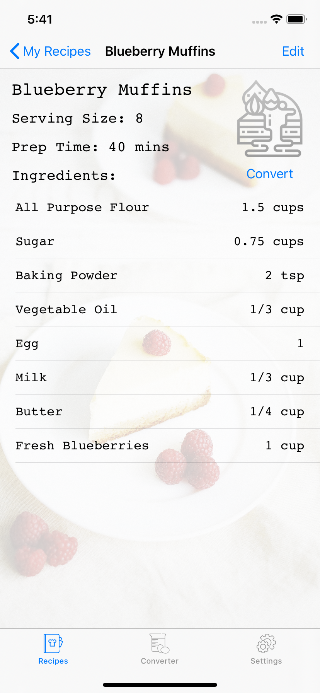

# A Sleek and Simple Recipe Manager App for iOS devices
### Created by Cassey Hu and Eddie Xu

Device Used: iPhone 11

### Recipe Tab
Displays all the recipes created by the current user with the option to add and delete recipes. Each recipe cell displays the basic information for the recipe: recipe name, serving size, prep time, and an image representing the recipe category. When the user taps on a recipe, they will be directed to the recipe view screen. Likewise, when the user taps on the add (+) button, they will be directed to the add recipe screen.

  

### Converter Tab
Users select a recipe from the dropdown to convert (or prefilled if the user clicked convert on a recipe) to populate the screen with the recipe details. Serving conversion text field contains a placeholder for the current serving size. Users can edit the serving size and click the scale button to convert the recipe ingredients temporarily. The main recipe will not be updated in the database.

      

### Settings Tab
Gives users the option to sort the recipe list by name, serving size, and prep time.

   

### New Recipe Screen
Compact UI for users to enter the name, type of, serving size, prep time, and ingredients of a new recipe. Users are required to fill all required fields for a new recipe. Pressing save persists the recipe into the Core Data of the app and brings the user back to the recipe tab screen where the new recipe can be found. 

      

### Recipe View Screen
Displays all the information about a recipe including the ingredients list. Users can also edit the current recipe which will direct them to the add/edit screen. Users can also convert the recipe on a larger/smaller scale which will direct them to the converter tab.

      

### Future Prospects

