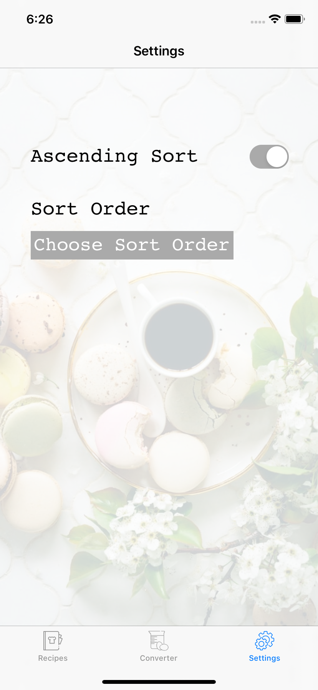
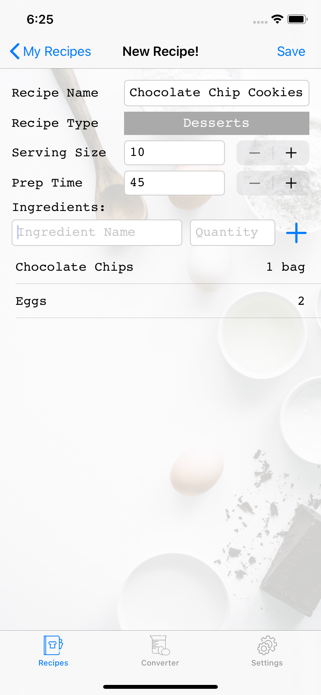

# A Sleek and Simple Recipe Manager App for iOS devices
### Created by Cassey Hu and Eddie Xu

Device Used: iPhone 11

### Introduction
Bring your beloved food constructs and kitchen creativity wherever you go with the Recipe Book: a sleek and simple iOS application that helps manage your very own recipes. The app is a frictionless way to save your recipes to your device without the constraints of a physical book-keep. With it’s elegant design comes many quality-of-life features such as recipe conversions to different servings, ease of recipe editing, and the ability to sort through your recipes in a quick and efficient manner. The Recipe Book will catalyze your time spent preparing for your everyday cravings and allow you to enjoy your creations sooner. 

### Recipe Tab
Displays all the recipes created by the current user with the option to add and delete recipes. Each recipe cell displays the basic information for the recipe: recipe name, serving size, prep time, and an image representing the recipe category. When the user taps on a recipe, they will be directed to the recipe view screen. Likewise, when the user taps on the add (+) button, they will be directed to the add recipe screen.

  

### Converter Tab
Users select a recipe from the dropdown to convert (or pre-filled if the user clicked convert on a recipe) to populate the screen with the recipe details. Serving conversion text field contains a placeholder displaying the current serving size. Users can edit the serving size and click the scale button to convert the recipe ingredients temporarily. Converting a recipe will not update the current recipe in the database.

      

### Settings Tab
Gives users the option to sort the recipe list by name, serving size, and prep time. Users can also use the toggle to enable or disable ascending sort.

   

### New Recipe Screen
Compact UI for users to enter the name, recipe type, serving size, prep time, and ingredients of a new recipe. Users are required to fill all required fields for a new recipe. Pressing save persists the recipe into the Core Data of the app and brings the user back to the Recipes tab where the new recipe can be found.

      

### Recipe View Screen
Displays all the information about a recipe including the ingredients list. Users can edit the current recipe by tapping the edit button which will direct them to the add/edit screen with pre filled information. Users also have the option to convert the current recipe on a larger/smaller scale by tapping the convert button which will redirect them to the converter screen. The converter screen will display the recipe and its current serving size.

      

### Future Prospects
To take things further, we are planning on implementing an external database and provide features like searching for other users of the app by their username and follow them and their own posted recipes. This can also be accomplished with some special functionality of locating users based on their location, say zip code, and allow them a choice of making their own cookbooks publicly available. 
